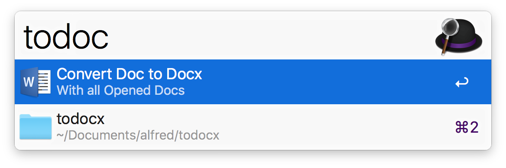

# alfred-todocx
An alfred workflow which can convert .doc to .docx

## How to install it

1. Download or clone the project
2. Open `Doc to Docx.alfredworkflow`

## How to use it 

1. Open all .doc files you want to convert
2. Use `todocx` command

3. It will convert them into .docx files and move all orginal .doc files to the trash
